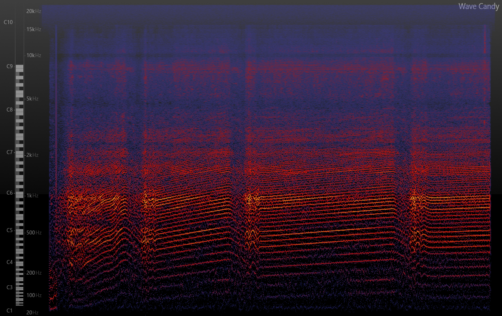
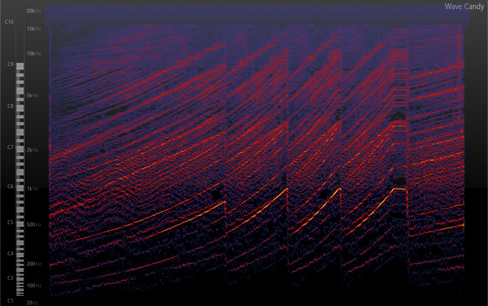
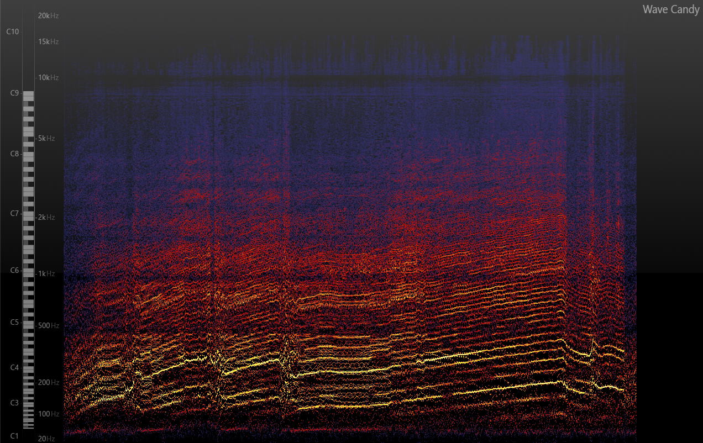
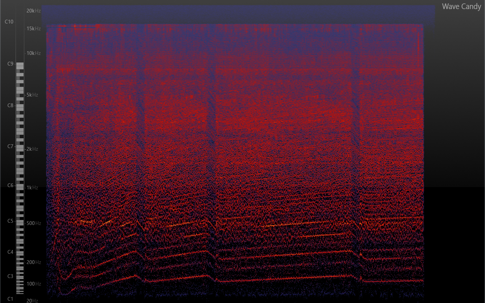
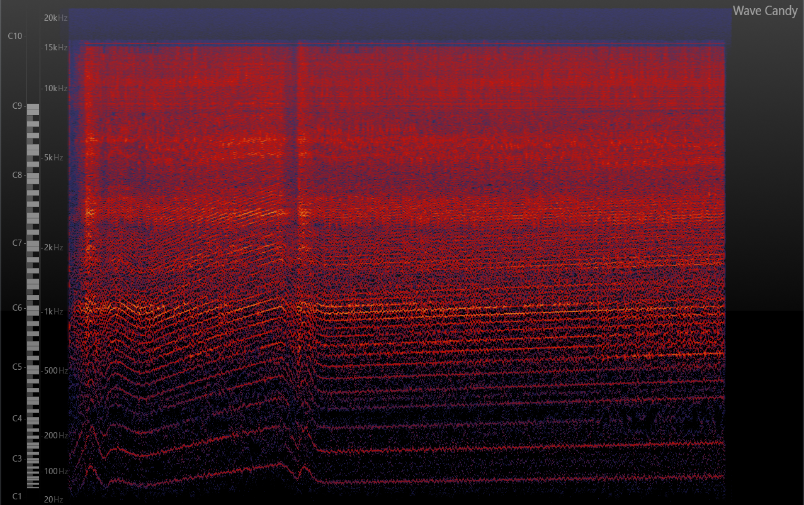

= Bericht
:project_name: SoundDesignProject
:sectnums:
:toc:

== Aufgabenstellung und Zielsetzung
Ziel des Projektes ist es, verschiedene Motorgeräusche zu synthetisieren und
sie anschließend mit einem vorgegebenen Video (Porsche 911) zusammenzuführen.

Zum Synthetisieren wird das Programm *https://puredata.info/[Pure-Data]* genutzt.

*Zielsetzung des Zwischenberichts*

* *Auditive*, sowie *technische Analyse* verschiedener Motorgeräusche mittels FL-Studio
* Erste Synthese verschiedener Frequenzen und Geräusche mittels Pure-Data

== Allgemeine Analyse verschiedener Motor-Geräusche
In diesem Abschnitt werden ausgewählte (Motor-)Geräusche
(u. a. hinsichtlich Wahrnehmung und Frequenz) untersucht.

=== Auditive Wahrnehmung
Zur *auditiven Wahrnehmung* gehört das persönliche Empfinden eines Geräusches
und dessen Wirkung auf den Hörer.

Als Audio-Beispiele werden im Hinblick auf die Zielstellung (Motorengeräusch)
dementsprechend verschiedene Arten von Motorengeräuschen.

Im folgenden Abschnitt werden die einzelnen Geräusche vorgestellt und anschließend
Empfindungen und gewonnene Eindrücke dargestellt.

==== Ausgewählte Testgeräusche
_Dominus:_

audio::../audio-files/Dominus.wav[]

_Esper:_

audio::../audio-files/Esper.wav[]

_Ford-GT-2006:_

audio::../audio-files/Ford-GT-2006.wav[]

_OEM-D-V2:_

audio::../audio-files/OEM-D-V2.wav[]

_Scarab:_

audio::../audio-files/Scarab.wav[]

==== Eindrücke und Empfindungen
*Dominus*

* keine "schrillen" Frequenzen
* tiefe Frequenzen vorhanden, aber nicht zu sehr ausgeprägt
* eher "hell", d.h. hochtouriges fahren
* Schaltvorgänge nicht prägnant, aber wahrnehmbar
* kein "satter" Umfang, somit eher für kleineres Auto passend (kein SUV, Truck, …)
* "knattern" entnehmbar
* höhen und tiefen kaum ausgeprägt
* vermittelt geschwindigkeit und wendigkeit, jedoch keine Kraft des Motors

Der Dominus-Motor hat keinen satten Frequenzumfang, Höhen und Tiefen sind wenig ausgeprägt. Dadurch klingt der Motor sehr hell, wobei jedoch keine schrillen Frequenzen auftreten. Der Motor hat ein deutlich wahrnehmbares "Knatter"-Geräusch, was eine angenehmes Feedback des Motors gibt. Das eher auf die Mitten begrenzte Frequenzspektrum vermittelt zwar eine hohe Geschwindigkeit, aber dennoch klingt der Motor schwach. Deswegen assoziiert man mit diesem Motorgeräusch eher ein kleines wendiges Auto.

*Esper*

* sehr "klirrend"
* extrem hell und sehr hohe Frequenzen
* Tiefen fehlen deutlich merkbar
* unpassend für Retro-Autos wie Porsche 911 mit Verbrennungsmotor
* erinnert an Zukunftsfahrzeuge mit anderer Technologie (Elektronik, Magnetismus, Induktion)
* Schaltvorgänge gut wahrnehmbar
* "Cyber-Like"-Stil (vermittelt modernes )
* ein typisches "Motor-Flattern" bzw Brummen fehlt komplett -> lineare Frequenzanstiege ohne Vibration
* Erinnert ohne Schaltvorgang und Kontext nicht an einen Motor

Der Esper-Motor erinnert ohne Beachtung des Kontext sowie den Schaltgeräuschen nicht an einen Motor. Er hat ein sehr klares und klirrendes Geräusch, welches eher an einen Synthesizer-Akkord, als an einen Motor erinnert. Dazu trägt außerdem das Fehlen eines Frequenzflatterns, welches mit Zündungen assoziiert wird bei. Das Motorgeräusch ist sehr von hohen Frequenzen geprägt und besitzt kaum Bässe. Dadurch wird mit dem Motor ein Sience-Fictionl oder Cyber-Stil vermittelt, welcher ganz im Gegensatz zu dem zu vertonenden Porsche 911 steht. Die Schaltgeräusche sind mit aprupten Frequenzänderungen umgesetzt.

*Ford-GT-2006*

* sehr tiefe Frequenzen gut hörbar (stark ausgeprägt)
* hohe Frequenzen nicht "zu aufdringlich", aber vorhanden
* passt sehr gut zu einem Auto wie Porsche 911
* Schaltvorgänge durch geringere Lautstärke realisiert
* klingt sehr kraftvoll
* durch hohedrehzahländerung wirkt er auch schnell ()

Der Ford-GT-2006-Motor

*OEM-D-V2*

* kein störendes "knattern" wie bei *Dominus*
* tiefe und hohe Frequenzen nicht zu aufdringlich,
* Frequenzen versuchen sich nicht gegenseitig zu übertönen
* angenehmes Geräusch, da keine sehr schrillen Töne vorhanden sind
* auch passend für Porsche 911 in bestimmter Situation
* klingt etwas dünn (zu wenig bass)-> wenig kraft, aber viel geschwindigkeit

*Scarab*

* sehr "helles" Geräusch
* keine wirklichen Tiefen
* "Knattern" sehr laut und aufdringlich
* erinnert an "Zweitakt-Motor" einer Simson
* durchgehendes Fahren im hochtourigen Bereich
* sehr ungeeignet für den Porsche 911

-> *Ergebnisse*

Allgemein wurden motorgeräusche mit einem ausgewogenen Frequenzspektrum als am angenehmste wargenommen. Dabei ist aufgefallen, dass vorallem die Bässe die Kraft des Motors beschreiben und die Mitten die derzeitige Geschwindigkeit wiederspiegeln. Die Höhen tragen stark zur wahrgenommenen Charakteristik bei, vorallem dem sägenden oder schrillen Beiklang eines Motors. Eine weitere entscheidende Größe ist die Zündfrequenz des Motors. Diese trägt, wenn sie schwach ausgeprägt und sehr schnell ist, zu einem dünnen, nicht kraftvollen Motorgeräusch bei. Stark ausgeprägt und etwas langsamer wirkt der Motor hingegen deutlich kraftvoller. Jedoch kann der Motor bei einem sehr stark auf der Zündfrequenz aufgebauten Geräusch auch unsauber, unrund bzw. kratzig klingen. Der wahrgenommene Drehzahlbereich des Motors ist entscheidend darüber, wie die Geschwindigkeitswahrnehmung des Motors ist. Ist das Spektrum eher schmal gibt es den Eindruck, dass der Motor sehr schnell seine maximale Drehzahl erreicht und somit kein großes Beschleunigungspotenzial hat.  Ein breiteres Spektrum wirkt deutlich dynamischer und vermittelt ein größeres Beschleunigungspotenzial. Ist der Motor jedoch zu dynamisch, hat also einen sehr großen Drehzahlbereich bekommt man den eindruck der Motor würde überdrehen und dementsprechend unsauber laufen, wodurch ein unruhiges Gefühl vermittelt wird.

---
=== Technische Analyse
In diesem Abschnitt werden die ausgewählten Geräusche hinsichtlich ihrer technischen
Eigenschaften untersucht und analysiert.

Dazu zählen u. a. die Analyse des Frequenzspektrums, sowie der Lautstärke / Amplituden.

Zur Analyse wird das Programm https://www.image-line.com/[FL-Studio], inklusive Plugins, genutzt.

==== Amplituden Analyse

==== Spektralanalyse

===== Konfiguration
* Genutztes FL-Studio-Plugin: WaveCandy
** Auflösung: 2048 bands
** Skala auf Werte kleiner Frequenz ausgerichtet (100 Hz - 10 kHz)
** Eingabe-Geräusche weitgehend normalisiert
** Update-Rate und Skala so gewählt, dass Frequenz-Spektrum deutlich sichtbar

===== Ergebnisse

*Dominus*

_Beschreibung:_ +
Auffällig sind besonders Hervorhebungen im 400 - 1000 Hz -Bereich.
Ebenfalls erkennbar sind "Rillen", in denen vergleichsweise die Lautstärke so niedrig war, dass die Frequenz in der Rille entlang nie besonders stark hervorgehoben wird. In diesem Fall handelt es sich um den Schaltvorgang, in welchem nicht beschleunigt wird und demzufolge der Motor Leerlauf-Geräusche abgibt.
Die Beschleunigungsphasen zwischen den Rillen, verändern den Frequenzbereich nur minimal, um eine Erhöhung der Frequenz um ca. 150 Hz.

image::../images/dominus_spectrum_freqband.png[]
_Frequenzband_

*Esper*

_Beschreibung:_ +
Auch hier sind Beschleunigungsphasen und Schaltvorgänge vorhanden und im Vergleich zu *Dominus* sehr viel deutlicher erkennbar. Die Frequenz ähnelt in diesem Fall einer "Sägezahn"-Kurve. Die Beschleunigungsphasen verändern die Frequenz auffällig stark, um ca. 400 Hz. Nach einer Phase folgt der Schaltvorgang und die Frequenz änder sich, indem sie wieder deutlich kleiner ist.

image::../images/esper_spectrum_freqband.png[]
_Frequenzband_

*Ford-GT-2006*

_Beschreibung:_ +
Bei diesem Beispiel sind besonders die gelben Bereiche (d.h. extrem stark ausgeprägt) deutlich erkennbar.
Damit erzeugt der Motor des Ford-GT-2006 ein Geräusch, welches einen sehr tieffrequenten Anteil besitzt.
Hohe Frequenzen gehen hierbei unter und sind nicht wahrnehmbar.
Der markante Frequenzbereich liegt insbesondere hier zwischen 100 Hz und 400 Hz.
Schaltvorgänge sind auch bei diesem Geräusch erkennbar.

Der Motor hat ein besonders basslastiges Frequenzspektrum, wobei besonders stark zwei parallel laufende Frequenzbänder auffallen. Im Schaltvorgang findet keine starke Amplitudenschwankung statt, jedoch kann mein einen starken Frequenz-Peak an dieser Stelle erkennen. Weiterhin lassen sich in den Beschleunigungsphasen an einigen Stellen abrupte Frequenzabbrüche feststellen.

image::../images/ford-gt_spectrum_freqband.png[]
_Frequenzband_

*OEM-D-V2*

_Beschreibung:_ +
In erster Linie sind in diesem Bild keine markanten Stellen oder Bereiche hervorgehoben.
Jede Frequenz ist ziemlich gleich stark vertreten, was bedeutet, dass es keinen besonders tiefen oder hellen
Frequenzanteil gibt. Demzufolge wird das Geräusch als Mitte wahrgenommen.
Bei genauerer Betrachtung fällt aber zumindest auf, dass Frequenzen kleiner als 200 Hz kaum vorzufinden sind.
Auch hier sind die Schaltvorgänge und Beschleunigungsphasen sichtbar.

Der Motor zeigt ein sehr unspezifisches Frequenzspektrum. Es liegt eine geringe Amplitudenverstärkung auf einem Frequenzband im 500 Hz Bereich vor. Der Schaltvorgang hat keine Besonderheiten, bis auf einen leichten Amplitudenverlust und eine linear absteigende Frequenzkurve.

image::../images/oem-d-v2_spectrum_freqband.png[]
_Frequenzband_

*Scarab*

_Beschreibung:_ +
Es fallen sofort die höherfrequenten Bereiche auf, welche im Vergleich zu den anderen Beispielen deutlich
ausgeprägter sind. Zwei Beschleunigungsphasen und zwei Schaltvorgänge sind sichtbar, die letzte
Beschleunigungsphase ist mehr als doppelt so lang wie die erste.
Unter 500 Hz sind kaum Frequenzen wahrnehmbar, dagegen im 1kHz bis 15 kHz umso mehr.
Besonders hervorstechend sind die 1kHz, 3 kHz und 7kHz -Bereiche.

Es fallen statisch lautere Frequenzbereiche im Mitten- und Höhen-Bereich auf.

image::../images/scarab_spectrum_freqband.png[]
_Frequenzband_

==== charakteristische Frequenzen
In diesem Abschnitt werden besonders hervorgegangene Frequenzen der jeweiligen Geräusche untersucht.

[cols="1,1,2"]
|===
|Motor-Geräusch         | Frequenzen in Hz                                           | Besonderheiten
|Dominus                | 1: 400 bis 500; 2: 750 bis 1k                              | 2 parallel verlaufende Frequenzbänder; Beschleunigungsphasen verändern Frequenz kaum
|Esper                  | 1: 300 bis 1k                                              | saubere "Sägezahn"-Kurve deutlich erkennbar; sehr dominante saubere (lineare?) Frequenzlinie, wellenartige modellierung in tieferen Frequenzbereichen
|Ford-GT-2006           | 1: 100 bis 200, 2: 200 bis 400                             | tiefer Frequenzgang (50 - 450 Hz) extrem stark ausgeprägt; 2 parallel verlaufende Frequenzbänder, welche sich abhängig von Leerlauf oder Beschleunigung in ihrer Amplitude abwechseln
|OEM-D-V2               | 1: 100 bis 140, 2: 220 bis 260, 3: 480 bis 530             | fast überall gleichstarker Anteil der Frequenz; ein dominantes, aber unsauberes Bassspektrum(1), obere spektren heben sich nicht stark hervor
|Scarab                 | 1: 70 bis 160, 2: 1k bis 2k, 3: 2,3k bis 3,1k              | hoher Frequenzgang (4 - 10 kHz) extrem stark ausgeprägt; unsauberes Bassspektrum, statisch lautere Frequenzbereiche im Mitten- und Höhen-Bereich (2,3)
|===

=== Fazit

== Geräusch-Synthese mit Pure-Data
== Quellen

link:https://www.youtube.com/watch?v=6YXdlF1p0i8[Rocket League®: All Engine Audio]

link:https://www.youtube.com/watch?v=Ft-55-Z-XIo[Gran Turismo Sport | Top 20 Best Engine Sound (4K)]

