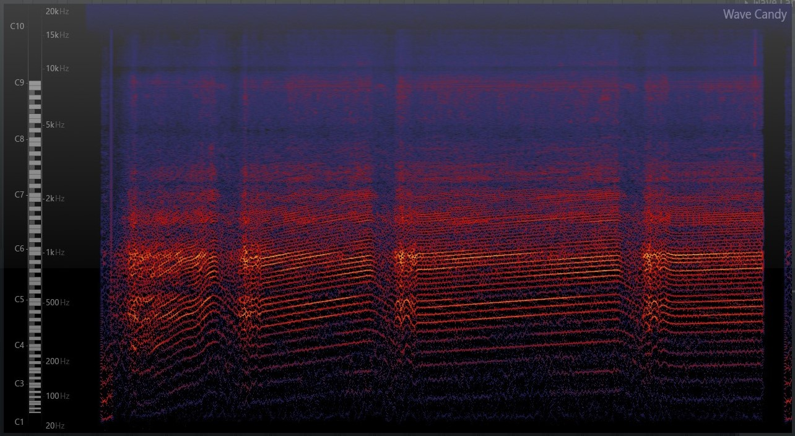

= Bericht
:project_name: SoundDesignProject
:sectnums:
:toc:

== Aufgabenstellung
Ziel des Projektes ist es, ein Motorgeräusch zu synthetisieren, mit welchem anschließend ein Video eines Porsche (911) neu vertont werden soll. Dazu soll in einer initialen Phase eine Wahrnehmungsstudie selbst ausgewählter Geräuschbeispiele durchgeführt werden. Diese soll zunächst in einer rein auditiv gestützten Beschreibung eine grobe Vorstellung des zu synthetisierende Sounds geben und anschließend in einer technischen Analyse Aufschluss über die näheren Zielsetzungen während der Soundsynthese geben.

== Allgemeine Analyse verschiedener Motor-Geräusche
=== Auditive Wahrnehmung

==== ausgewählte Testgeräusche
Dominus:

audio::../audio-files/Dominus.wav[]

Esper:

audio::../audio-files/Esper.wav[]

Ford-GT-2006:

audio::../audio-files/Ford-GT-2006.wav[]

OEM-D-V2:

audio::../audio-files/OEM-D-V2.wav[]

Scarab:

audio::../audio-files/Scarab.wav[]

==== Wahrnehmungs-Beschreibung

[options="header",cols="1h,4"]
|===

|Name
|Beschreibung

|Dominus
|Das Motorgeräusch hat einen recht ausgeglichenen Klang. Es stechen keine prägnanten Höhen oder Tiefen des Geräusches hervor. Das Bass-Spektrum des Motors ist mager und etwas dumpf, wodurch der Motor etwas schwächer, jedoch aber auch leichter und wendiger wirkt. Die Mitten haben einen aggressiven, druckvollen Klang, welcher zu dem Geschwindigkeitsgefühl beiträgt. Die Höhen klingen sehr dünn und haben einen hohen Rauschanteil, was dem Motor einen zischenden Beiklang gibt und sich eher störend auf das langzeitige Geräuscherlebnis ausübt. Der Frequenzunterschied bei Drehzahländerung ist in einem angenehmen Bereich, sodass keine schrillen Geräusche entstehen. Der Schaltvorgang ist am Frequenzsprung zwei gestuft, wodurch der Motor etwas weniger aggressiv, dadurch aber auch etwas schwächer klingt.

|Esper
|

|Ford-GT-2006
|

|OEM-D-V2
|

|Scarab
|

|===

==== Schlussfolgerungen
---
=== Technische Analyse
==== Amplituden Analyse
==== Spektralanalyse
- Dominus:

==== charakteristische Frequenzen
==== Dynamik
== Fazit
== Quellen

link:https://www.youtube.com/watch?v=6YXdlF1p0i8[Rocket League®: All Engine Audio]

link:https://www.youtube.com/watch?v=Ft-55-Z-XIo&t=1211s[Gran Turismo Sport | Top 20 Best Engine Sound (4K)]

link:http://www.audio-consequent.de/info/inf_klbegriffe.htm[Begriffe zur Klangbeschreibung]

